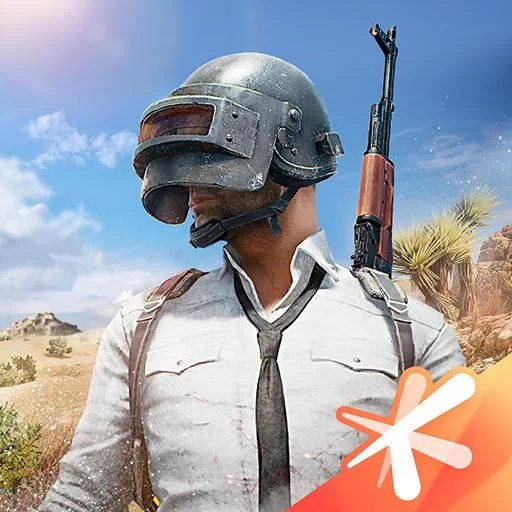

**PUBG MOBILE - Mad Miramar by Tencent Games**

com.tencent.ig
Version: 0.18.0(12600)
Updated: Apr 27, 2020
Size: 1.67GB

**Update News**:

1. **Miramar Update**
   Additional resources have been added to the map, including items and improved graphics. 
   Added a race track and Golden Mirado to show off your skills in the desert!
2. **Sandstorm**
   Prepare well to survive in the extreme climate!
   A sandstorm theme is waiting for you to unlock in the lobby!
3.Cheer Park
Cheer Park
Cheer Park



And
Cheer Park
Cheer Park
Try out this chill 20 player area where you can chat, roast chicken 
oid
Specifications
CPU: arm64-v8ap
CPU: arm64-v8ap
**com.tencent.ig.apk \[49.62MB]**
https://checker.in/go/4618697
**main.12600.com.tencent.ig.obb \[1.63GB]**
https://checker.in/go/4618699

**How to install .obb file?**

Goto File manager and navigate to this folder local storage / Android / obb.

heck if there is a folder named com.tencent.ig if not, create a folder with name com.tencent.ig

heck if there is a folder named com.tencent.ig if not, create a folder with name com.tencent.ig
Move main.12600.com.tencent.ig.obb file into local storage / Android / obb / com.tencent.ig folder
Then launch the game and enjoy!obb