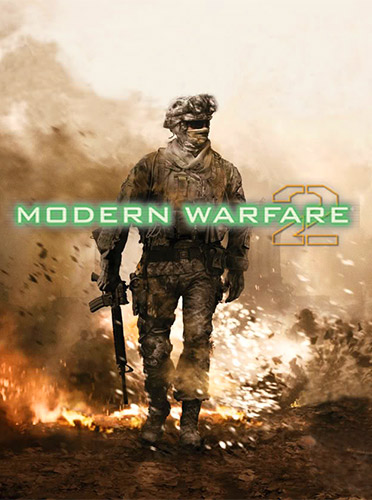

Return to today’s war front with the second chapter in the Modern Warfare series. Modern Warfare 2 continues the gripping and heart-racing action as players face off against a new threat dedicated to bringing the world to the brink of collapse. Playing as as Sgt. Gary “Roach” Sanderson, your international squad of elite soldiers battle through harrowing combat scenarios that range from snowy mountaintops in Siberia to the crowded streets of Rio de Janiero, Brazil and beyond, facing a terrorist force hellbent on redefining the boundary lines of today’s modern warfare. Players can face the threat alone or with other players in cooperative SpecOps mode. For even more intense combat, take up arms against online foes in enhanced deathmatch warfare on a host of Modern Warfare 2 maps.

General Features:

EPIC SINGLE-PLAYER CAMPAIGN – A riveting story picks up immediately following the thrilling events from Call of Duty 4: Modern Warfare.
 SPECIAL OPS CO-OPERATIVE — An entirely new gameplay mode which supports 2-player co-operative play via online or split screen that is unique from the single player story campaign. Special Ops pits players into a gauntlet of time-trial and objective-based missions. Missions include highlights from the single player campaign, fan favorites from Call of Duty 4: Modern Warfare and all new, exclusive missions. Rank-up as players unlock new Special Ops missions, each more difficult.
 MULTIPLAYER REINVENTED — Modern Warfare 2 multiplayer delivers new capabilities, customization, gamestates and modes, including: Customizable Killstreaks, Accolades (post match reports) & evolved Create-a-Class.

Publisher: Activision
 Developer: Infinity Ward
 Genre: First Person Shooter.     
 
Install Notes: 
1. Unpack release                                              
2. Mount image or burn it                                             
3. Install                                                   
4. Copy the content from the SKIDROW directory on DVD2 to your  installation directory and overwrite                        
5. Play the game                                               

       Additional Notes:                                              
 This is game of the year for sure. We removed the protection  from the multiplayer exe too, but if you want the true multiplayer experience on Steam servers - Buy it!